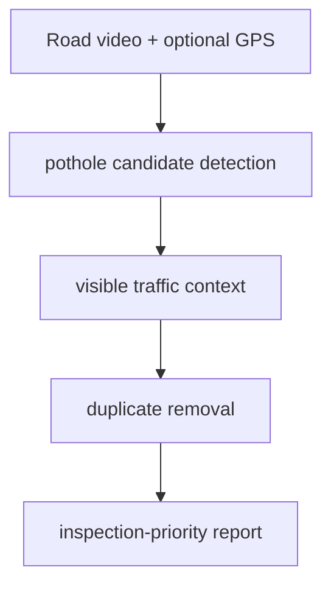

# Architecture

## Future Pipeline Diagram

## Module Explanations
- **app.py**: Main Streamlit dashboard interface.
- **src/video_io.py**: Handles loading and parsing video files.
- **src/detectors/**: Contains ML models to detect potholes in video frames.
- **src/analytics/**: Evaluates visible traffic context to support prioritization.
- **src/fusion/**: Aggregates detections across frames to remove duplicates.
- **src/scoring/**: Generates inspection-priority scores.
- **src/exporters/**: Exports final results and reports.
