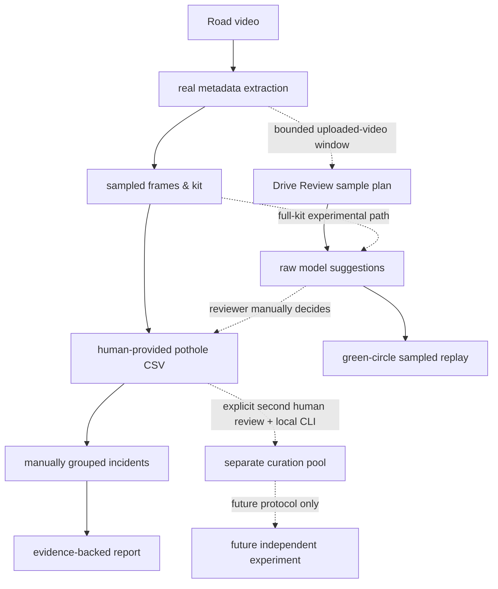

# Architecture

## Pipeline Diagram

## Module Explanations
- **app.py**: Main Streamlit dashboard interface.
- **src/video_io.py**: Handles loading, parsing video files, and sampling frames for the kit.
- **src/manual_annotations.py**: Parses and strictly validates human-provided annotations.
- **src/aggregation.py**: Groups annotations by human-provided `incident_id` and selects representative evidence frames.
- **src/reporting.py**: Generates CSVs, `summary.json`, and an annotated MP4 of sampled frames.
- **src/analysis_runner.py**: Orchestrates the manual baseline pipeline.
- **src/ml/model_provenance.py**: Fail-closed verification of the pinned local frozen checkpoint and its training provenance before model loading.
- **src/ml/local_model_runtime.py**: Lazy, local-only YOLO prediction adapter; it never trains, evaluates, or downloads weights.
- **src/ml/video_inference.py**: Renders raw experimental per-frame suggestions for the already-sampled frames without creating manual incidents.
- **src/ml/experimental_inference.py**: Keeps experimental model settings/provenance separate from the manual contracts.
- **src/ml/drive_review.py**: Builds a bounded, contiguous upload-backed source-window plan and requests the green-circle presentation mode. It has no camera, model framework, training, or evaluation dependency.
- **scripts/infer_pothole_video.py**: Optional local CLI for the same hash-pinned experimental suggestions workflow.
- **src/ml/manual_curation.py**: Validates a second human frame-review CSV and exports only explicitly confirmed sampled JPEGs plus class-0 YOLO labels into a separate local curation pool.
- **scripts/curate_manual_pothole_batch.py**: Explicit dry-run/write-only CLI for that curation pool; it never trains, evaluates, or changes a frozen dataset.
- *(Note: Manual reports remain human-CSV-only. Drive Review is sampled playback, not a live dashcam alert. Experimental model suggestions are not manual observations, verified incidents, traffic analytics, automatic fusion, or risk scoring. A curation pool is not a training dataset and does not alter the frozen baseline.)*
