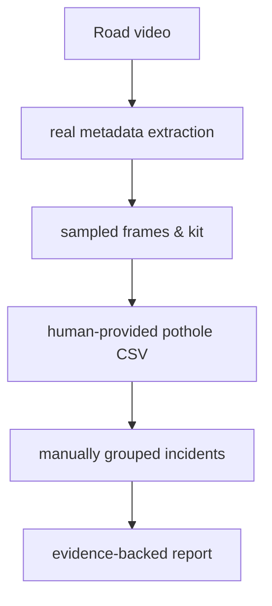

# Architecture

## Pipeline Diagram

## Module Explanations
- **app.py**: Main Streamlit dashboard interface.
- **src/video_io.py**: Handles loading, parsing video files, and sampling frames for the kit.
- **src/manual_annotations.py**: Parses and strictly validates human-provided annotations.
- **src/aggregation.py**: Groups annotations by human-provided `incident_id` and selects representative evidence frames.
- **src/reporting.py**: Generates CSVs, `summary.json`, and an annotated MP4 of sampled frames.
- **src/analysis_runner.py**: Orchestrates the manual baseline pipeline.
- *(Note: ML detectors, traffic analytics, automatic fusion, and risk scoring are not currently active in the manual baseline.)*
