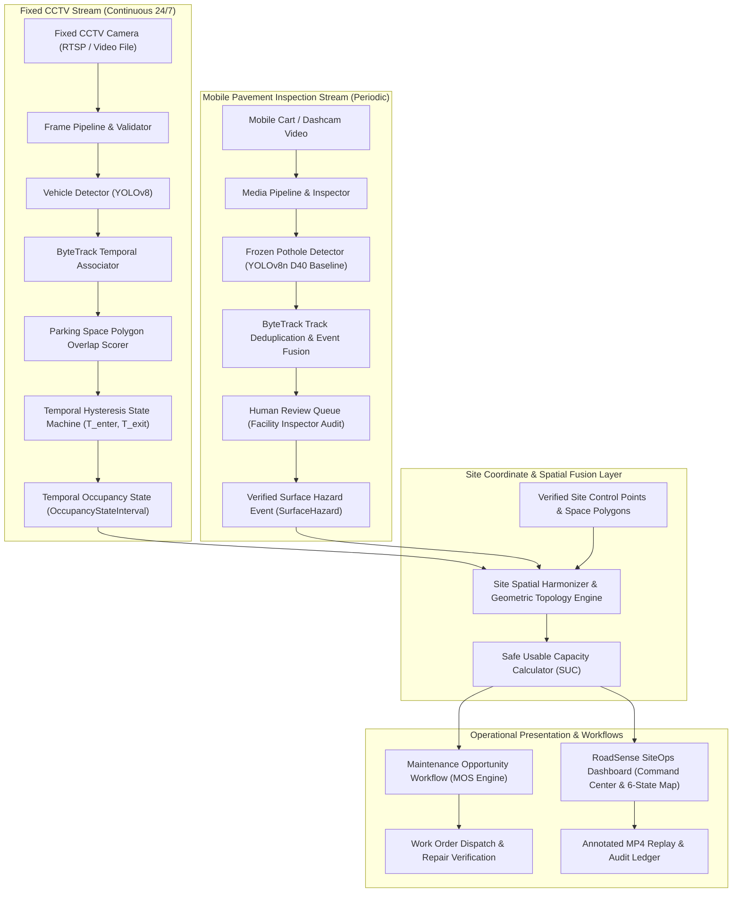

# RoadSense SiteOps — Hazard-Aware Parking System & Data Architecture
## Multi-Modal Spatio-Temporal Architecture, Entity Data Model & Geometry Calibration

> **Classification:** System Architecture & Data Engineering Specification
> **Status:** Architecture Baseline (Pre-Implementation)
> **Repository:** `RoadSense-India-`
> **Branch:** `feat/hazard-aware-parking-research`

---

## 1. System Overview & Dual-Stream Fusion Architecture

RoadSense SiteOps integrates two asynchronous visual telemetry streams into a unified site spatial coordinate layer:
1. **Fixed Overhead CCTV Stream (High Temporal Frequency, Static Perspective):** Monitors parking stall occupancy dynamics, vehicle ingress/egress dwell times, and aisle blockage via continuous video feeds.
2. **Mobile Inspection Dashcam Stream (Low Temporal Frequency, High Pavement Resolution):** Captures high-detail pavement condition data from security or utility carts traversing facility aisles.



---

## 2. Relational & Spatial Entity Data Model

The persistence layer extends the existing PostgreSQL/PostGIS database schema with 14 first-class entities.

```
┌─────────────────┐       ┌─────────────────┐       ┌─────────────────────┐
│      Site       │───<───│     Camera      │───<───│OccupancyObservation │
└────────┬────────┘       └─────────────────┘       └──────────┬──────────┘
         │                                                     │
         │                ┌─────────────────┐                  │
         ├───<────────────│   ParkingZone   │                  │
         │                └────────┬────────┘                  ▼
         │                         │                ┌─────────────────────┐
         │                         ├───<────────────│OccupancyStateInterval│
         │                         │                └─────────────────────┘
         │                         ▼
         │                ┌─────────────────┐       ┌─────────────────────┐
         ├───<────────────│  ParkingSpace   │───<───│HazardSpaceAssociation│
         │                └────────┬────────┘       └──────────▲──────────┘
         │                         │                           │
         │                         ▼                ┌──────────┴──────────┐
         ├───<────────────│  ApproachZone   │───<───│    SurfaceHazard    │
         │                └─────────────────┘       └──────────▲──────────┘
         │                                                     │
         │                ┌─────────────────┐                  │
         └───<────────────│MaintenanceOrder │───<──────────────┤
                          └────────┬────────┘                  │
                                   ▼                           ▼
                          ┌─────────────────┐       ┌─────────────────────┐
                          │RepairVerification│      │     HumanReview     │
                          └─────────────────┘       └─────────────────────┘
```

### 2.1 Entity Specifications

#### 1. `Site`
- **Purpose:** Represents the top-level physical facility campus (e.g., "City Central Hospital - Main Campus").
- **Essential Fields:** `id` (UUID), `name` (string), `site_code` (string), `boundary_polygon` (PostGIS `Polygon`), `timezone` (string), `created_at` (timestamp).
- **Provenance:** Configured by system administrator during facility onboarding.
- **Retention:** Permanent.
- **Relationships:** One-to-many with `Camera`, `ParkingZone`, `SurfaceHazard`, `MaintenanceWorkOrder`.

#### 2. `Camera`
- **Purpose:** Represents a physical fixed CCTV camera sensor covering parking zones.
- **Essential Fields:** `id` (UUID), `site_id` (UUID), `camera_identifier` (string), `rtsp_url` (string, encrypted), `focal_length_mm` (float), `mount_height_m` (float), `mount_angle_deg` (float), `calibration_matrix` (JSON), `calibration_status` (enum: `UNINITIALIZED`, `VALID`, `DRIFT_DETECTED`, `INVALID`), `last_calibration_time` (timestamp).
- **Provenance:** Hardware configuration log and operator camera registry.
- **Retention:** Permanent.
- **Relationships:** Belongs to `Site`; one-to-many with `OccupancyObservation`, `MediaArtifact`.

#### 3. `ParkingZone`
- **Purpose:** Logical grouping of parking spaces within a facility (e.g., "Staff Deck Level 1", "Emergency Ingress Lot").
- **Essential Fields:** `id` (UUID), `site_id` (UUID), `zone_name` (string), `zone_type` (enum: `VISITOR`, `STAFF`, `EMERGENCY`, `DELIVERY`, `MIXED`), `priority_weight` (float $\in [0.1, 1.0]$), `zone_polygon` (PostGIS `Polygon`).
- **Provenance:** Facility map survey and operator definition.
- **Retention:** Permanent.
- **Relationships:** Belongs to `Site`; one-to-many with `ParkingSpace`.

#### 4. `ParkingSpace`
- **Purpose:** Individual physical parking bay.
- **Essential Fields:** `id` (UUID), `zone_id` (UUID), `space_number` (string), `pixel_polygon_coords` (JSON 4-point list on camera reference frame), `world_polygon` (PostGIS `Polygon`), `status_verification` (enum: `UNVERIFIED`, `HUMAN_APPROVED`), `is_active` (boolean).
- **Provenance:** Operator-configured polygon with human confirmation timestamp.
- **Retention:** Permanent.
- **Relationships:** Belongs to `ParkingZone`; one-to-one with `ApproachZone`; one-to-many with `OccupancyStateInterval`, `HazardSpaceAssociation`.

#### 5. `ApproachZone`
- **Purpose:** The immediate roadway or aisle access polygon required for a vehicle to enter or exit a given `ParkingSpace`.
- **Essential Fields:** `id` (UUID), `space_id` (UUID), `approach_pixel_polygon` (JSON), `approach_world_polygon` (PostGIS `Polygon`), `traversal_direction_deg` (float).
- **Provenance:** Derived from parking lane geometry and verified by operator.
- **Retention:** Permanent.
- **Relationships:** Belongs to `ParkingSpace`; one-to-many with `HazardSpaceAssociation`.

#### 6. `OccupancyObservation`
- **Purpose:** Fine-grained, frame-level vehicle detection and tracking instance on fixed CCTV.
- **Essential Fields:** `id` (UUID), `camera_id` (UUID), `frame_timestamp` (timestamp), `frame_number` (int), `track_id` (int), `vehicle_bbox` (JSON `[x1, y1, x2, y2]`), `det_confidence` (float), `space_overlap_ratios` (JSON `{space_id: overlap_ratio}`).
- **Provenance:** Emitted by local YOLO + ByteTrack video pipeline.
- **Retention:** Ephemeral / Rolling window (7 days), aggregated into state intervals.
- **Relationships:** Belongs to `Camera`.

#### 7. `OccupancyStateInterval`
- **Purpose:** Spatio-temporal occupancy interval representing continuous duration in one of the 6 formal states.
- **Essential Fields:** `id` (UUID), `space_id` (UUID), `state` (enum: `FREE_SAFE`, `FREE_UNSAFE`, `OCCUPIED`, `BLOCKED`, `UNKNOWN`, `NEEDS_REVIEW`), `start_time` (timestamp), `end_time` (timestamp, nullable if ongoing), `trigger_reason` (string), `associated_track_id` (int, nullable).
- **Provenance:** Emitted by temporal hysteresis state engine.
- **Retention:** Long-term historical analytics (min 365 days).
- **Relationships:** Belongs to `ParkingSpace`.

#### 8. `SurfaceHazard`
- **Purpose:** Verified road or stall surface defect (pothole, deep subsidence, exposed obstacle).
- **Essential Fields:** `id` (UUID), `site_id` (UUID), `hazard_type` (enum: `D40_POTHOLE`, `SUBSIDENCE`, `DEBRIS_OBSTACLE`), `centroid_coord` (PostGIS `Point`), `bounding_footprint` (PostGIS `Polygon`), `initial_observed_time` (timestamp), `review_status` (enum: `CANDIDATE_UNREVIEWED`, `CONFIRMED_ACTIVE`, `REJECTED_FALSE_ALARM`, `REPAIRED_RESOLVED`), `persistence_count` (int), `current_mos_score` (float).
- **Provenance:** Mobile inspection pipeline + HumanReview confirmation.
- **Retention:** Permanent audit record.
- **Relationships:** Belongs to `Site`; one-to-many with `HazardSpaceAssociation`, `HumanReview`, `MaintenanceWorkOrder`.

#### 9. `HazardSpaceAssociation`
- **Purpose:** Geometric and topological mapping linking a verified `SurfaceHazard` to a `ParkingSpace` or its `ApproachZone`.
- **Essential Fields:** `id` (UUID), `hazard_id` (UUID), `space_id` (UUID), `target_type` (enum: `STALL_INTERIOR`, `APPROACH_LANE`), `overlap_percentage` (float), `is_blocking` (boolean).
- **Provenance:** Computed by Spatial Topology Engine upon hazard confirmation.
- **Retention:** Linked to lifecycle of `SurfaceHazard`.
- **Relationships:** Belongs to `SurfaceHazard` and `ParkingSpace`.

#### 10. `HumanReview`
- **Purpose:** Immutable audit record of inspector action on a candidate detection or state conflict.
- **Essential Fields:** `id` (UUID), `hazard_id` (UUID, nullable), `session_id` (UUID), `reviewer_username` (string), `action` (enum: `CONFIRM_POTHOLE`, `REJECT_FALSE_ALARM`, `MODIFY_POLYGON`, `OVERRIDE_STATE`), `notes` (string), `reviewed_at` (timestamp).
- **Provenance:** Created exclusively through operator UI interaction.
- **Retention:** Permanent immutable audit log.
- **Relationships:** Belongs to `SurfaceHazard` or `DriveSession`.

#### 11. `MaintenanceWorkOrder`
- **Purpose:** Actionable maintenance ticket to repair one or more verified hazards.
- **Essential Fields:** `id` (UUID), `site_id` (UUID), `work_order_code` (string), `target_hazard_ids` (array of UUIDs), `target_space_ids` (array of UUIDs), `recommended_window_start` (timestamp), `recommended_window_end` (timestamp), `status` (enum: `PROPOSED`, `DISPATCHED`, `COMPLETED`, `CANCELLED`), `priority_score` (float).
- **Provenance:** Generated by Maintenance Opportunity Score ($MOS$) planner.
- **Retention:** Permanent.
- **Relationships:** Belongs to `Site`; one-to-many with `RepairVerification`.

#### 12. `RepairVerification`
- **Purpose:** Verification record confirming physical repair of pavement defects.
- **Essential Fields:** `id` (UUID), `work_order_id` (UUID), `hazard_id` (UUID), `verified_by` (string), `verification_method` (enum: `POST_REPAIR_MOBILE_DRIVE`, `PHYSICAL_INSPECTION_SIGN_OFF`), `repaired_at` (timestamp), `status` (enum: `VERIFIED_CLEAR`, `DEFECT_PERSISTS`).
- **Provenance:** Post-repair mobile inspection session or inspector sign-off.
- **Retention:** Permanent.
- **Relationships:** Belongs to `MaintenanceWorkOrder` and `SurfaceHazard`.

#### 13. `MediaArtifact`
- **Purpose:** Tracks raw videos, sampled frames, annotated MP4 exports, and homography calibration snapshots.
- **Essential Fields:** `id` (UUID), `session_id` (UUID), `artifact_type` (enum: `RAW_CCTV`, `RAW_MOBILE`, `ANNOTATED_MP4`, `CALIBRATION_IMAGE`), `file_path_relative` (string), `sha256_hash` (string), `file_size_bytes` (bigint), `created_at` (timestamp).
- **Provenance:** Generated by local video processor and FFmpeg encoder.
- **Retention:** Configurable retention (e.g., 30 days for video, permanent for metadata).
- **Relationships:** Belongs to `DriveSession` / `Camera`.

#### 14. `ModelProvenance`
- **Purpose:** Strict reproducibility record pinning ML weights, configs, and runtime fingerprints.
- **Essential Fields:** `id` (UUID), `model_identifier` (string), `weights_sha256` (string), `config_sha256` (string), `architecture` (string), `training_dataset_fingerprint` (string), `is_pinned_active` (boolean).
- **Provenance:** Verified during fail-closed startup via `model_provenance.py`.
- **Retention:** Permanent.
- **Relationships:** Referenced across all automated detection records.

---

## 3. Geometric Reasoning, Polygon Calibration & Spatial Harmonization

### 3.1 Honest Geometric Baseline (No False Auto-Discovery Claims)
- **Manual Polygon Baseline:** In the RoadSense SiteOps MVP, all parking space polygons ($P_i$) and approach zones ($A_i$) are **manually configured and explicitly human-verified** on the fixed camera reference frame.
- **Auto-Proposal Non-Claim:** Automated ROI suggestions (e.g., clustering recurring parked vehicle centroids) may only serve as tentative drafting aids. They are **never** committed into production without explicit human validation.

### 3.2 Camera Calibration & Homography Workflow
To map 2D camera pixels to metric ground-plane coordinates without fabricating 3D geometry:
1. **Reference Frame Capture:** A high-resolution calibration frame is captured during uniform lighting conditions.
2. **Ground Control Points (GCPs):** The operator marks at least 4 surveyed ground control points (e.g., painted stall corners, aisle intersection markers with known metric distances).
3. **Planar Homography ($H$):** A planar homography matrix $H \in \mathbb{R}^{3 \times 3}$ is computed:

   $$\mathbf{x}_{\text{world}} \sim H \mathbf{x}_{\text{image}}$$

4. **Visible Calibration State:** The UI displays calibration health: `VALID` (green badge), `DRIFT_SUSPECTED` (yellow), or `UNCALIBRATED` (red).
5. **Camera Shift Invalidation:** If pole vibration or wind shift alters background keypoint alignment ($\Delta > \epsilon$), calibration is invalidated immediately and states transition to `UNKNOWN` until re-verified.

### 3.3 Spatial Fusion Between Mobile Inspection & Fixed CCTV
Mobile dashcam video and fixed CCTV video operate on disparate coordinate frames:
- **Rule for Spatial Fusion:** Mobile pavement hazard observations and fixed CCTV occupancy observations **must NEVER be spatially fused unless they share a verified, surveyed site coordinate system**.
- **No Fabricated GPS:** In indoor or shadowed parking garages where consumer GPS accuracy degrades ($> 5\text{m}$ error), mobile detections are assigned to parking bays via **visual landmark matching or aisle sequence indexing**, never by interpolating false GPS coordinates.

---

## 4. MVP Architecture & Explicit Boundary Definition

### 4.1 MVP System Deliverables
1. **Fixed Camera Ingest:** 1 RTSP or recorded fixed CCTV stream (10–30 bays).
2. **Manual Space Configuration:** UI polygon editor with save/edit/verify capabilities.
3. **Tracking & State Machine:** YOLO vehicle detection + ByteTrack + 6-state temporal hysteresis engine.
4. **Mobile Pavement Ingest:** Upload and processing of mobile cart inspection video.
5. **Frozen Pothole Detection:** Verified execution of pinned YOLOv8n D40 baseline.
6. **Human Review Queue:** Interactive defect confirmation and space-linking interface.
7. **Safe Usable Capacity Dashboard:** Live counter ($SUC$), color-coded 6-state lot map, and state breakdown.
8. **Annotated Local MP4 Replay:** Generated via local FFmpeg subprocess.
9. **Immutable Audit Log:** Complete PostgreSQL/PostGIS change history.
10. **100% Local Execution:** Subprocess-hardened, zero outbound cloud calls.

### 4.2 System Exclusions (Deferred to Future Research)
- License plate recognition (ALPR), vehicle re-identification across lots, facial recognition, payment/fines, automated work order contractor dispatch, and automated 3D volumetric depth reconstruction.

---

## 5. Portfolio & Recruiter Positioning

### 5.1 Concise Portfolio Statement
> **“RoadSense SiteOps is a privacy-conscious visual operations system that fuses mobile pavement inspection with fixed-camera parking occupancy to estimate safe usable capacity and support evidence-based facility maintenance.”**

### 5.2 Core Engineering Capabilities Demonstrated
1. **Computer Vision & Tracking:** Multi-object detection (YOLOv8), multi-frame tracking (ByteTrack), track management under occlusion.
2. **Temporal State Modeling:** Deterministic multi-state finite state machines with entry/exit hysteresis and flicker suppression.
3. **Geometric & Spatial Reasoning:** Planar homography calibration, polygon intersection metrics, and approach-zone reachability modeling.
4. **Multi-Modal Asynchronous Evidence Fusion:** Reconciling high-cadence fixed CCTV streams with periodic mobile inspection logs.
5. **Backend & Systems Architecture:** FastAPI async worker pipeline, robust job management, subprocess-hardened FFmpeg streaming, and fail-closed model provenance.
6. **Spatial Data Engineering:** PostgreSQL 16 with PostGIS spatial indexing, polygon intersections, and immutable audit ledgers.
7. **Human-in-the-Loop AI Design:** Decision-support review queues preventing raw noisy model detections from triggering operational actions.
8. **Privacy Engineering:** Local-first data sovereignty, zero biometric/plate retention, and strict Content Security Policies.
9. **Rigorous Applied Research:** Formal metric formulations ($SUC, FSR, MOS$), leak-free evaluation protocols, and transparent scientific reporting.
10. **Product Thinking:** Translating raw computer vision bounding boxes into quantifiable commercial value for facility operations.

---

## 6. Preliminary Literature & Prior-Art References

1. **Baseline Parking Detector Reference:**
   - Sanjarbek, *ParkingSpaceDetector*, GitHub Repository, 2024.
     URL: `https://github.com/sanjarbek1030/ParkingSpaceDetector`
     *Baseline Note: Declares an MIT license; demonstrates static YOLO polygon overlap. RoadSense establishes that this baseline lacks tracking, temporal state hysteresis, hazard fusion, and approach-zone modeling.*
2. **USDOT SMART Curb-Management & Infrastructure Initiatives:**
   - U.S. Department of Transportation, *Strengthening Mobility and Revolutionizing Transportation (SMART) Stage 1 Implementation Reports*, 2024.
     URL: `https://www.transportation.gov/grants/smart/stage-1-smart-grants-final-implementation-reports`
3. **IEEE Smart Parking Systems Literature:**
   - IEEE Transactions on Intelligent Transportation Systems, *Deep Learning and Computer Vision for Smart Parking Management: A Comprehensive Survey*, 2024.
     DOI / Document: `https://ieeexplore.ieee.org/document/10479293/`
4. **IEEE Road Surface Digital-Twin & Defect Literature:**
   - IEEE Access / Transactions on Instrumentation and Measurement, *Vision-Based Road Damage Digital-Twin Modeling and Multi-Sensor Infrastructure Assessment*, 2024.
     DOI / Document: `https://ieeexplore.ieee.org/document/10798477/`

> **Prior-Art Review Requirement:** These citations serve as preliminary architectural reference points. A formal, exhaustive academic literature and patent prior-art survey remains required before asserting formal patentability or novel discovery claims.

---

## 7. Current System State & Pipeline Defect Acknowledgement

> **Engineering Status Disclosure:**
> The RoadSense media processing and tracking pipeline is currently under active development. While the architecture, database schema, API contracts, and user interface foundations are established, **the underlying media pipeline has known correctness findings under active remediation** (specifically: streaming H.264 pipe synchronization, strict fail-closed media inspection, bounded upload memory buffers, and ByteTrack deterministic frame association). These findings are explicitly acknowledged as open engineering work and are **not** described as production-resolved.
