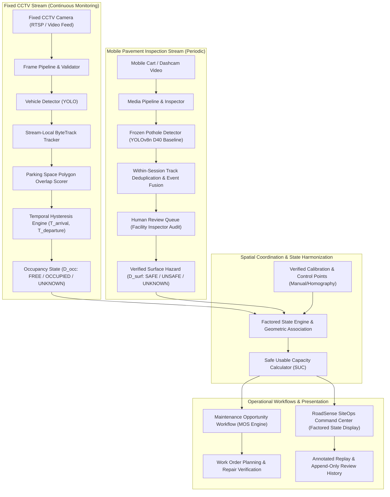

# RoadSense SiteOps — Hazard-Aware Parking System & Data Architecture
## Multi-Modal Spatio-Temporal Architecture, Entity Data Model & Geometry Calibration

> **Classification:** System Architecture & Data Engineering Specification
> **Status:** Architecture Baseline (Pre-Implementation)
> **Repository:** `RoadSense-India-`
> **Branch:** `feat/hazard-aware-parking-research`

---

## 1. System Overview & Dual-Stream Fusion Architecture

RoadSense SiteOps integrates two asynchronous visual telemetry streams into a unified site spatial coordinate layer:
1. **Fixed Overhead CCTV Stream (High Temporal Frequency, Static Perspective):** Monitors parking stall occupancy dynamics, vehicle dwell times, and aisle blockage via continuous video feeds.
2. **Mobile Inspection Dashcam Stream (Low Temporal Frequency, High Pavement Resolution):** Captures high-detail pavement condition data from mobile vehicles or carts traversing facility aisles.



---

## 2. Relational & Spatial Entity Data Model

The persistence layer organizes data into 14 distinct entities stored in PostgreSQL/PostGIS.

```
┌─────────────────┐       ┌─────────────────┐       ┌─────────────────────┐
│      Site       │───<───│     Camera      │───<───│OccupancyObservation │
└────────┬────────┘       └─────────────────┘       └──────────┬──────────┘
         │                                                     │
         │                ┌─────────────────┐                  │
         ├───<────────────│   ParkingZone   │                  │
         │                └────────┬────────┘                  ▼
         │                         │                ┌─────────────────────┐
         │                         ├───<────────────│OccupancyStateInterval│
         │                         │                └─────────────────────┘
         │                         ▼
         │                ┌─────────────────┐       ┌─────────────────────┐
         ├───<────────────│  ParkingSpace   │───<───│HazardSpaceAssociation│
         │                └────────┬────────┘       └──────────▲──────────┘
         │                         │                           │
         │                         ▼                ┌──────────┴──────────┐
         ├───<────────────│  ApproachZone   │───<───│    SurfaceHazard    │
         │                └─────────────────┘       └──────────▲──────────┘
         │                                                     │
         │                ┌─────────────────┐                  │
         └───<────────────│MaintenanceOrder │───<──────────────┤
                          └────────┬────────┘                  │
                                   ▼                           ▼
                          ┌─────────────────┐       ┌─────────────────────┐
                          │RepairVerification│      │     HumanReview     │
                          └─────────────────┘       └─────────────────────┘
```

### 2.1 Entity Specifications

#### 1. `Site`
- **Purpose:** Physical facility campus boundary (e.g., "City Central Hospital - Main Campus").
- **Essential Fields:** `id` (UUID), `name` (string), `site_code` (string), `boundary_polygon` (PostGIS `Polygon`), `timezone` (string), `created_at` (timestamp).
- **Provenance:** Configured by system administrator during facility setup.
- **Retention:** Permanent.
- **Relationships:** One-to-many with `Camera`, `ParkingZone`, `SurfaceHazard`, `MaintenanceWorkOrder`.

#### 2. `Camera`
- **Purpose:** Fixed CCTV camera sensor covering a parking zone.
- **Essential Fields:** `id` (UUID), `site_id` (UUID), `camera_identifier` (string), `rtsp_url` (string, encrypted), `focal_length_mm` (float), `mount_height_m` (float), `mount_angle_deg` (float), `calibration_matrix` (JSON), `calibration_status` (enum: `NOT_CONFIGURED`, `PENDING_REVIEW`, `VERIFIED`, `INVALIDATED`), `last_calibration_time` (timestamp).
- **Provenance:** Camera hardware registration log.
- **Retention:** Permanent.
- **Relationships:** Belongs to `Site`; one-to-many with `OccupancyObservation`, `MediaArtifact`.

#### 3. `ParkingZone`
- **Purpose:** Grouping of parking spaces (e.g., "Staff Deck Level 1", "Emergency Ingress Lot").
- **Essential Fields:** `id` (UUID), `site_id` (UUID), `zone_name` (string), `zone_type` (enum: `VISITOR`, `STAFF`, `EMERGENCY`, `DELIVERY`, `MIXED`), `priority_weight` (float $\in [0.1, 1.0]$), `zone_polygon` (PostGIS `Polygon`).
- **Provenance:** Facility map survey and operator definition.
- **Retention:** Permanent.
- **Relationships:** Belongs to `Site`; one-to-many with `ParkingSpace`.

#### 4. `ParkingSpace`
- **Purpose:** Individual physical parking bay.
- **Essential Fields:** `id` (UUID), `zone_id` (UUID), `space_number` (string), `pixel_polygon_coords` (JSON 4-point list on camera reference frame), `world_polygon` (PostGIS `Polygon`, nullable), `status_verification` (enum: `UNVERIFIED`, `HUMAN_APPROVED`), `is_active` (boolean).
- **Provenance:** Operator-configured polygon with human confirmation timestamp.
- **Retention:** Permanent.
- **Relationships:** Belongs to `ParkingZone`; one-to-one with `ApproachZone`; one-to-many with `OccupancyStateInterval`, `HazardSpaceAssociation`.

#### 5. `ApproachZone`
- **Purpose:** The immediate roadway or aisle access polygon required for a vehicle to access a given `ParkingSpace`.
- **Essential Fields:** `id` (UUID), `space_id` (UUID), `approach_pixel_polygon` (JSON), `approach_world_polygon` (PostGIS `Polygon`, nullable), `traversal_direction_deg` (float, nullable).
- **Provenance:** Configured by operator alongside parking space boundary.
- **Retention:** Permanent.
- **Relationships:** Belongs to `ParkingSpace`; one-to-many with `HazardSpaceAssociation`.

#### 6. `OccupancyObservation`
- **Purpose:** Frame-level vehicle detection and tracking observation from fixed CCTV.
- **Essential Fields:** `id` (UUID), `camera_id` (UUID), `frame_timestamp` (timestamp), `frame_number` (int), `stream_track_id` (int), `vehicle_bbox` (JSON `[x1, y1, x2, y2]`), `det_confidence` (float), `space_overlap_ratios` (JSON `{space_id: overlap_ratio}`).
- **Provenance:** Emitted by local YOLO + ByteTrack video pipeline.
- **Retention:** Ephemeral rolling window (e.g., 24–72 hours), aggregated into state intervals.
- **Relationships:** Belongs to `Camera`.

#### 7. `OccupancyStateInterval`
- **Purpose:** Spatio-temporal interval recording continuous status across factored dimensions.
- **Essential Fields:** `id` (UUID), `space_id` (UUID), `occupancy_dim` (enum: `FREE`, `OCCUPIED`, `UNKNOWN`), `surface_dim` (enum: `SAFE`, `UNSAFE`, `UNKNOWN`), `obstruction_dim` (enum: `CLEAR`, `BLOCKED`, `UNKNOWN`), `derived_availability` (enum: `FREE_SAFE`, `FREE_UNSAFE`, `OCCUPIED`, `BLOCKED`, `UNKNOWN`), `start_time` (timestamp), `end_time` (timestamp, nullable), `trigger_reason` (string).
- **Provenance:** Emitted by temporal hysteresis state engine.
- **Retention:** Long-term historical analytics (e.g., 365 days).
- **Relationships:** Belongs to `ParkingSpace`.

#### 8. `SurfaceHazard`
- **Purpose:** Verified road or stall surface defect (pothole, deep subsidence, physical hazard).
- **Essential Fields:** `id` (UUID), `site_id` (UUID), `hazard_type` (enum: `D40_POTHOLE`, `SUBSIDENCE`, `DEBRIS_OBSTACLE`), `centroid_coord` (PostGIS `Point`, nullable), `bounding_footprint` (PostGIS `Polygon`, nullable), `initial_observed_time` (timestamp), `review_status` (enum: `UNREVIEWED`, `CONFIRMED`, `REJECTED`, `NEEDS_REVIEW`), `persistence_count` (int), `current_mos_score` (float).
- **Provenance:** Mobile inspection pipeline + HumanReview confirmation.
- **Retention:** Permanent audit record.
- **Relationships:** Belongs to `Site`; one-to-many with `HazardSpaceAssociation`, `HumanReview`, `MaintenanceWorkOrder`.

#### 9. `HazardSpaceAssociation`
- **Purpose:** Explicit geometric or operator-audited mapping linking a `SurfaceHazard` to a `ParkingSpace` or its `ApproachZone`.
- **Essential Fields:** `id` (UUID), `hazard_id` (UUID), `space_id` (UUID), `target_type` (enum: `STALL_INTERIOR`, `APPROACH_LANE`), `association_method` (enum: `MANUAL_OPERATOR_LINK`, `CALIBRATED_GEOMETRY`), `is_blocking` (boolean).
- **Provenance:** Computed by Spatial Topology Engine or assigned in Human Review Queue.
- **Retention:** Linked to lifecycle of `SurfaceHazard`.
- **Relationships:** Belongs to `SurfaceHazard` and `ParkingSpace`.

#### 10. `HumanReview`
- **Purpose:** Append-only application-level audit record of operator actions on candidate detections or state overrides.
- **Essential Fields:** `id` (UUID), `hazard_id` (UUID, nullable), `session_id` (UUID), `reviewer_username` (string), `action` (enum: `CONFIRM_POTHOLE`, `REJECT_FALSE_ALARM`, `MODIFY_POLYGON`, `OVERRIDE_STATE`), `notes` (string), `reviewed_at` (timestamp).
- **Provenance:** Created exclusively through operator UI interaction.
- **Retention:** Append-only persistent review history.
- **Relationships:** Belongs to `SurfaceHazard` or `DriveSession`.

#### 11. `MaintenanceWorkOrder`
- **Purpose:** Proposed or dispatched maintenance ticket to repair verified hazards.
- **Essential Fields:** `id` (UUID), `site_id` (UUID), `work_order_code` (string), `target_hazard_ids` (array of UUIDs), `target_space_ids` (array of UUIDs), `recommended_window_start` (timestamp), `recommended_window_end` (timestamp), `status` (enum: `PROPOSED`, `DISPATCHED`, `COMPLETED`, `CANCELLED`), `priority_score` (float).
- **Provenance:** Generated by Maintenance Opportunity Score ($MOS$) planner.
- **Retention:** Permanent.
- **Relationships:** Belongs to `Site`; one-to-many with `RepairVerification`.

#### 12. `RepairVerification`
- **Purpose:** Record verifying completion and closure of physical pavement repairs.
- **Essential Fields:** `id` (UUID), `work_order_id` (UUID), `hazard_id` (UUID), `verified_by` (string), `verification_method` (enum: `POST_REPAIR_MOBILE_DRIVE`, `PHYSICAL_INSPECTION_SIGN_OFF`), `repaired_at` (timestamp), `status` (enum: `VERIFIED_CLEAR`, `DEFECT_PERSISTS`).
- **Provenance:** Post-repair inspection session or inspector sign-off.
- **Retention:** Permanent.
- **Relationships:** Belongs to `MaintenanceWorkOrder` and `SurfaceHazard`.

#### 13. `MediaArtifact`
- **Purpose:** Tracks raw videos, sampled frames, annotated MP4 exports, and calibration snapshots.
- **Essential Fields:** `id` (UUID), `session_id` (UUID), `artifact_type` (enum: `RAW_CCTV`, `RAW_MOBILE`, `ANNOTATED_MP4`, `CALIBRATION_IMAGE`), `file_path_relative` (string), `sha256_hash` (string), `file_size_bytes` (bigint), `created_at` (timestamp).
- **Provenance:** Generated by local video processor and FFmpeg encoder.
- **Retention:** Configurable retention (e.g., 24–72 hours for raw operational video; permanent for export metadata).
- **Relationships:** Belongs to `DriveSession` / `Camera`.

#### 14. `ModelProvenance`
- **Purpose:** Reproducibility record pinning ML weights, configs, and runtime fingerprints.
- **Essential Fields:** `id` (UUID), `model_identifier` (string), `weights_sha256` (string), `config_sha256` (string), `architecture` (string), `training_dataset_fingerprint` (string), `is_pinned_active` (boolean).
- **Provenance:** Verified during fail-closed startup via `model_provenance.py`.
- **Retention:** Permanent.
- **Relationships:** Referenced across all automated detection records.

---

## 3. Geometric Reasoning, Polygon Calibration & Fusion Boundaries

### 3.1 Strict Geometric Fusion Boundaries
To ensure geometric validity and prevent erroneous spatial assumptions:
1. **No Automatic Cross-Camera Video Mapping:** Mobile dashcam pothole detections **cannot** automatically map to CCTV parking polygons from video appearance alone.
2. **Incomparable Image Coordinates:** Pixel coordinates from disparate cameras (mobile vs. fixed) are entirely distinct reference frames and are **not** directly comparable.
3. **Planar Homography Limitations:** Planar homography applies strictly where the mapped lot surface is sufficiently planar and surveyed ground control points are valid.
4. **Calibration Status Lifecycle & Stability Gate:** The system maintains an explicit camera calibration state:
   - `NOT_CONFIGURED`: Camera registered without geometric calibration.
   - `PENDING_REVIEW`: Ground control points marked, awaiting validation.
   - `VERIFIED`: Calibration active, planar error within tolerance.
   - `INVALIDATED`: Camera movement or background drift detected; geometric projections disabled.
5. **Fail-Closed Camera Stability Guard:**
   - Operational inference is guarded by automated visual feature matching (ORB / homography decomposition) against the calibration reference image.
   - **Gate Logic:** `ALLOWED` strictly when a fresh assessment is `STABLE` and its reference image SHA matches the active verified layout SHA. Any `UNSTABLE`, `INSUFFICIENT_EVIDENCE`, missing, errored, or stale assessment transitions the operational gate to `BLOCKED`.
   - **Geometry Preservation:** Automated stability blocking **never silently mutates or deletes human-verified geometry**. The verified polygon coordinates remain intact in the database for operator review, audit, or explicit re-verification/invalidation.
6. **Handling Unregistered Observations:** In the absence of a verified shared coordinate system, mobile hazard observations remain **unassociated** until linked manually by a human reviewer in the Review Queue. The system will **never** guess or interpolate unverified coordinates.

---

## 4. MVP Architecture & Boundary Definition

### 4.1 MVP Scope (Phase 1)
1. **Single Fixed Camera:** Ingest 1 RTSP or local video stream covering 10–30 bays.
2. **Manual Space Configuration:** UI polygon tool for human-verified parking space and approach zone boundaries.
3. **Tracking & Factored State Engine:** YOLO vehicle detection + stream-local ByteTrack + factored occupancy state machine.
4. **Mobile Pavement Ingest:** Upload and processing of mobile cart inspection video.
5. **Frozen Pothole Detection:** Pinned YOLOv8n D40 baseline execution.
6. **Human Review Queue:** Interactive defect confirmation and manual hazard-to-space linking.
7. **Safe Usable Capacity Dashboard:** Live counter ($SUC$), factored state lot map, and state summary.
8. **Annotated Local MP4 Replay:** Generated locally via FFmpeg subprocess.
9. **Append-Only Review History:** Application-level audit logging of review actions and state changes.
10. **100% Local Execution:** Subprocess-hardened, zero outbound cloud calls.

### 4.2 System Exclusions (Deferred to Future Research)
- License plate recognition (ALPR), vehicle re-identification across lots, facial recognition, payment/fines, automated work order contractor dispatch, and automated 3D volumetric depth reconstruction.

---

## 5. Recruiter, Industry & Novelty Positioning

### 5.1 Portfolio Statement
> **“RoadSense SiteOps is a privacy-conscious visual operations system that fuses mobile pavement inspection with fixed-camera parking occupancy to estimate safe usable capacity and support evidence-based facility maintenance.”**

### 5.2 Scoped Contribution Framing
- **Potential Operational & Systems Contribution:** Combining independently observed parking occupancy, human-reviewed pavement hazards, temporal state estimation, and maintenance planning into a unified safe-usable-capacity workflow.
- **Explicit Scoping Boundaries:**
  - *Product Differentiation:* Fusing pavement condition with occupancy to provide true usable capacity.
  - *Engineering Contribution:* Stream-local tracking, fail-closed model provenance, and spatial database architecture.
  - *Research Hypotheses:* Formulated directional hypotheses (H1–H4) for empirical evaluation.
  - *Formal Academic Novelty / Patentability:* Not claimed; deferred until comprehensive prior-art review and benchmark validation.

---

## 6. Preliminary Literature & Prior-Art References

1. **Baseline Parking Detector Reference:**
   - Sanjarbek, *ParkingSpaceDetector*, GitHub Repository, 2024.
     URL: `https://github.com/sanjarbek1030/ParkingSpaceDetector`
     *(Baseline Note: Declares an MIT license; demonstrates static YOLO polygon overlap. RoadSense establishes that this baseline lacks tracking, temporal state hysteresis, hazard fusion, and approach-zone modeling).*
2. **USDOT SMART Curb-Management Initiatives:**
   - U.S. Department of Transportation, *Strengthening Mobility and Revolutionizing Transportation (SMART) Stage 1 Implementation Reports*, 2024.
     URL: `https://www.transportation.gov/grants/smart/stage-1-smart-grants-final-implementation-reports`
3. **IEEE Smart Parking Systems Literature:**
   - IEEE AICCSA, *Vision Transformer based Intelligent Parking System for Smart Cities*, 2023.
     Document: `10479293` | DOI: `10.1109/AICCSA59173.2023.10479293`
     URL: `https://ieeexplore.ieee.org/document/10479293/`
4. **IEEE Road Surface Digital-Twin Literature:**
   - IEEE Internet of Things Journal, *Real-Time Pothole Detection With Edge Intelligence and Digital Twin in Internet of Vehicles*, 2024.
     Document: `10798477` | DOI: `10.1109/JIOT.2024.3517342`
     URL: `https://ieeexplore.ieee.org/document/10798477/`

> **Prior-Art Review Requirement:** These preliminary references do not constitute a systematic academic, commercial, or patent prior-art search. A complete search remains required before making formal novelty claims.

---

## 7. Current System State & Pipeline Defect Acknowledgement

> **Engineering Status Disclosure:**
> The RoadSense media processing and tracking pipeline is currently under active development. While the architecture, database schema, API contracts, and user interface foundations are established, **the underlying media pipeline has known correctness findings under active remediation** (specifically: streaming H.264 pipe synchronization, strict fail-closed media inspection, bounded upload memory buffers, and ByteTrack deterministic frame association). These findings are explicitly acknowledged as open engineering work and are **not** described as production-resolved.
